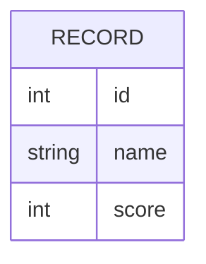

# Domain Model

Service2 holds a single fixed catalog of scored records; Service1 reads that
catalog to compute an aggregate. There is one entity.

`RECORD` is the seeded, scored catalog entry Service2 serves. Its catalog
mode (full or empty) is a property of Service2's own state, not a second
entity — full mode serves the ten seeded records verbatim, empty mode serves
none.