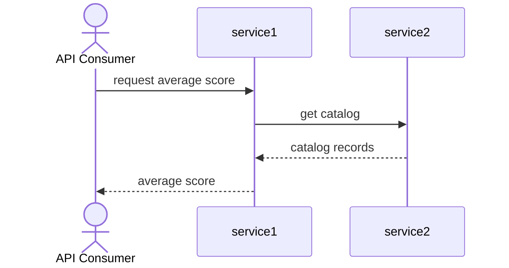

# Get Average Score

An API Consumer asks Service1 for the current average score; Service1 fetches
the current catalog from Service2 and computes the result.

```mermaid
sequenceDiagram
    actor Consumer as API Consumer
    participant service1
    participant service2

    Consumer->>service1: request average score
    service1->>service2: get catalog
    service2-->>service1: catalog records
    service1-->>Consumer: average score
```

